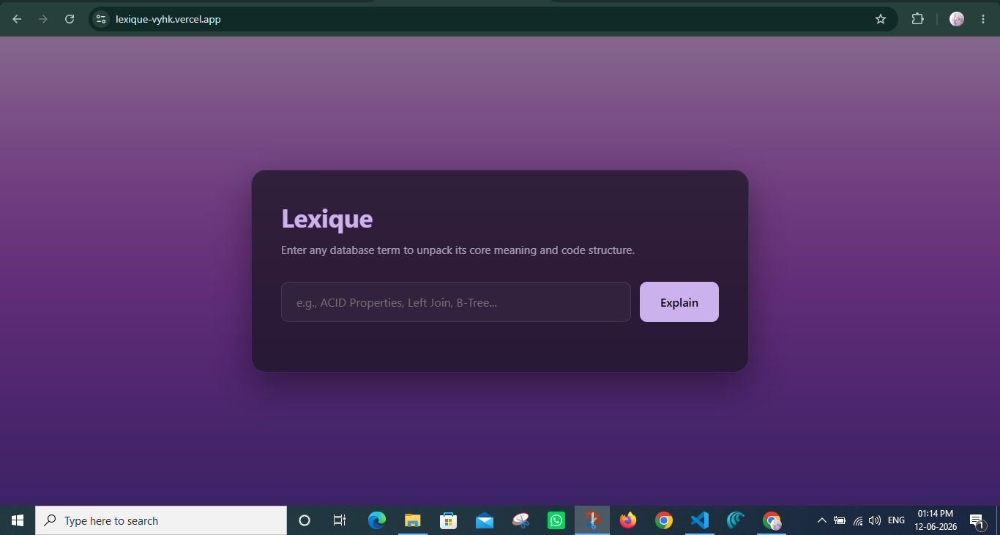
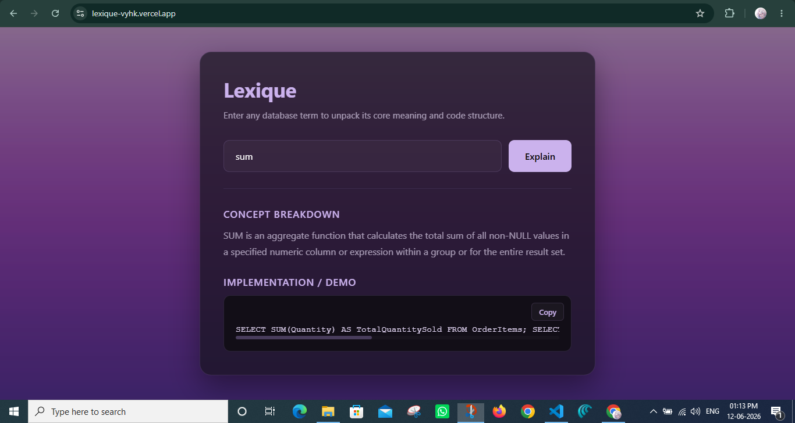
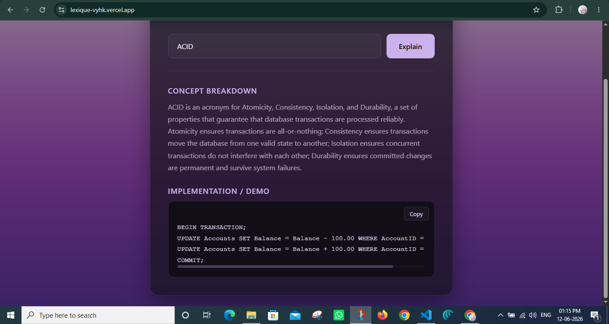

# Lexique 💜

Lexique is a minimalist AI-powered dictionary for Database Management System (DBMS) concepts. It transforms technical database terminology into clear explanations and practical SQL implementations, helping students and developers understand both theory and application in a single interface.

Built with Flask, vanilla HTML/CSS/JavaScript, and Google's Gemini API, the application is deployed as a serverless web application on Vercel.

## 🔗 Live Application

**Production URL:** https://lexique-vyhk.vercel.app

---

## 📸 Preview

### Home Interface



### Example: SQL Aggregate Function (SUM)



### Example: ACID Acronym Breakdown



---

## ✨ Features

### AI-Powered DBMS Explanations

Uses Google's `gemini-2.5-flash` model to generate concise and understandable explanations for database concepts, SQL commands, normalization techniques, indexing strategies, transaction properties, and more.

### Practical Implementation Examples

Each concept is accompanied by a relevant SQL implementation or demonstration, helping bridge the gap between theory and practice.

### Minimalist User Experience

Designed with a clean dark-themed interface featuring subtle glassmorphic styling, a carefully curated purple color palette, and a distraction-free workflow.

### One-Click Copy Functionality

Generated SQL examples can be copied instantly for experimentation, assignments, or project work.

### Structured Response Rendering

Responses are generated through a predefined JSON schema, ensuring consistent formatting and reliable frontend rendering.

---

## 🏗️ System Architecture

```text
User
  ↓
Flask Backend
  ↓
Gemini API
  ↓
Structured JSON Response
  ↓
Frontend Rendering
```

The application accepts a DBMS term from the user, sends it to the backend, generates a structured response using Gemini, and renders both the explanation and implementation example dynamically on the frontend.

---

## 🛠️ Technology Stack

### Backend

* Python 3.x
* Flask

### Frontend

* HTML5
* CSS3
* Vanilla JavaScript
* Fetch API

### AI Integration

* Google Gemini API (`gemini-2.5-flash`)

### Deployment

* Vercel Serverless Functions (`@vercel/python`)

### Dependency Management

* UV Package Manager

---

## 📂 Project Structure

```text
├── main.py
├── .env
├── .gitignore
├── requirements.txt
├── vercel.json
├── README.md
├── assets/
│   ├── gp1.png
│   ├── gp2.png
│   ├── gp3.png
│   └── gp4.png
├── static/
│   └── bg.png
└── templates/
    └── index.html
```

---

## 🚀 Local Development Setup

### Prerequisites

Before running the project locally, ensure you have:

* Python 3.x installed
* UV installed

### Clone the Repository

```bash
git clone <repository-url>
cd <repository-name>
```

### Create a Virtual Environment

```bash
pip install uv
uv venv
```

### Activate the Environment

#### macOS / Linux

```bash
source .venv/bin/activate
```

#### Windows PowerShell

```powershell
.venv\Scripts\Activate.ps1
```

#### Windows Command Prompt

```cmd
.venv\Scripts\activate.bat
```

### Install Dependencies

```bash
uv pip install -r requirements.txt
```

### Configure Environment Variables

Create a `.env` file in the project root:

```env
GEMINI_API_KEY=your_google_ai_studio_api_key
```

### Run the Application

```bash
python main.py
```

Then navigate to:

```text
http://127.0.0.1:5000
```

---

## 🌐 Deployment

Lexique is configured for deployment on Vercel using Python Serverless Functions.

To deploy:

1. Connect the repository to Vercel.
2. Configure the `GEMINI_API_KEY` under Project Settings → Environment Variables.
3. Trigger a deployment.

The local `.env` file is protected through `.gitignore` and should never be committed to source control.

---

## 👩‍💻 Author

**Vaishnavi Bhan**
Computer Science Graduate | AI & Full-Stack Development

---

Built with Flask, Gemini AI, and a passion for making database concepts easier to understand.
